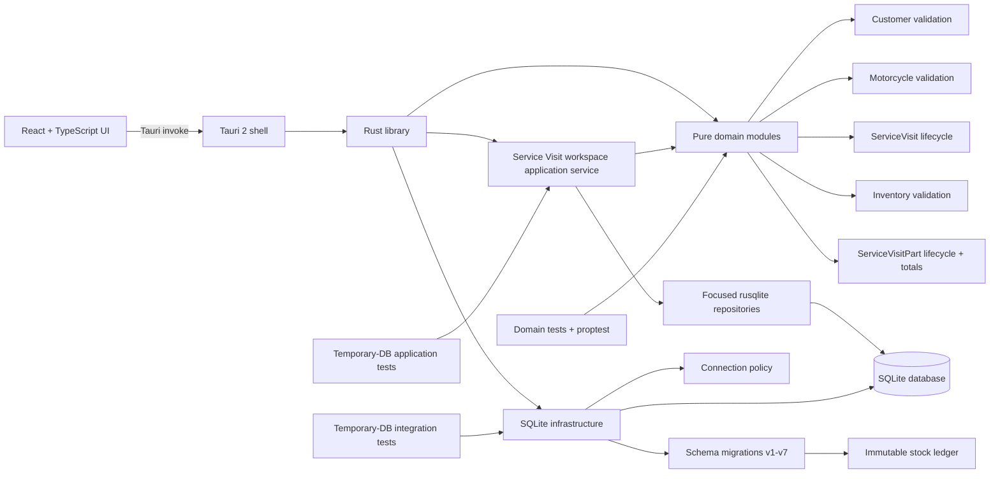

# Software Architecture

This is the living overview of how the application is connected. It reflects the current schema version 7 working tree and must be updated whenever responsibilities or data flow change.

## Current shape



## Frontend

- `src/main.tsx` mounts the React application.
- `src/App.tsx` is still the default Tauri/Vite demonstration UI.
- No Customer or Motorcycle production UI exists yet.
- The frontend contains no persistence logic.

## Tauri shell

- The application uses Tauri 2.
- `src-tauri/src/main.rs` starts `moto_workshop_lib::run()`.
- `src-tauri/src/lib.rs` configures the Tauri builder and opener plugin.
- The only registered command is the template `greet` command. No workshop CRUD commands exist yet.

## Rust library boundaries

`src-tauri/src/lib.rs` exposes three top-level areas and keeps repositories internal:

- `application`: production use-case orchestration;
- `domain`: pure business validation and typed value objects.
- `db`: SQLite connection policy and ordered migrations.
- `repositories`: focused rusqlite persistence adapters used by the application layer.

Domain objects do not depend on SQLite, Tauri, or the system clock. The application layer depends on domain behavior and concrete repository operations, while repositories contain SQL and row mapping but no workflow policy. No speculative generic repository abstraction exists.

## Domain modules

### Customer

`domain/customer.rs` owns creation-time Customer validation and normalization:

- private `NewCustomer` state with read-only accessors;
- Unicode-aware name and notes bounds;
- canonical Jordanian phone normalization;
- typed validation errors.

### Motorcycle

`domain/motorcycle.rs` owns Motorcycle input validation and identity value objects:

- `PlateNumber` and complete `JordanPlate`;
- strict standardized `Vin`;
- separate `ChassisNumber` for non-VIN frame identifiers;
- model, year, notes, and identity validation;
- identity requires plate, VIN, or chassis.

### Service Visit

`domain/service_visit.rs` models an active or historical workshop visit:

- `ServiceVisitStatus` contains only Open, ReadyForPickup, Closed, and Cancelled;
- creation produces an OPEN aggregate from named input;
- focused methods update active details and perform allowed lifecycle transitions;
- READY reopening clears `completed_at`;
- CLOSED/CANCELLED reject ordinary edits;
- complaint, optional workshop text, cancellation reason, odometer, and integer-fils labor are validated without persistence or clock dependencies.

The domain accepts an owner snapshot ID but cannot verify ownership itself. Migration 5 enforces that relationship against the current Motorcycle row at insertion.

### Inventory

`domain/inventory.rs` owns pure Inventory validation:

- `QuantityScale` permits only 1, 10, 100, or 1000 integer subunits per displayed unit;
- `InventoryUnit` normalizes reusable unit names;
- `InventoryItem` validates names, optional case-preserved SKU input, unit identity, integer-fils default prices, scaled minimum stock, and notes;
- `StockMovementType` includes the four manual types plus ServiceUsage and ServiceUsageReversal;
- linked usage types require a positive ServiceVisitPart ID and exact sign while manual types require no Part reference;
- `StockMovement` validates exact integer ranges and relationship shapes without querying current stock;
- all timestamps are supplied by callers, and no type depends on SQLite, Tauri, React, floating point, or the system clock.

Stock Movement instances expose no mutation behavior. Persistence supplies the permanent immutability boundary.

### Service Visit Part

`domain/service_visit_part.rs` owns immutable historical snapshots, ACTIVE-to-VOIDED lifecycle behavior, optional void-reason normalization, and the single checked integer line-total calculation. It accepts caller-supplied IDs, catalog snapshots, charged price, and timestamps but does not query persistence. SQLite verifies the snapshots against current catalog rows when inserting.

## Persistence

### Service Visit workspace repositories

`repositories/service_visit.rs` loads the complete Service Visit workspace header and historical Part rows, and owns the focused INSERT/UPDATE statements for work fields and Part mutations. `repositories/inventory.rs` loads selectable non-archived Inventory Items joined to active Unit metadata. Both remain persistence-focused and return owned rows; they do not calculate totals, normalize business input, or decide lifecycle policy.

### Service Visit workspace application service

`application/service_visit_workspace.rs` is the first production use-case layer. It:

- loads a Service Visit with its owner snapshot, Motorcycle presentation data, and ACTIVE/VOIDED Part history;
- validates mutable work-field updates through the existing ServiceVisit domain lifecycle;
- lists usable Inventory Items with current Unit name, scale, and suggested selling price;
- accepts only Item/Visit IDs, scaled quantity, charged price, and caller-supplied timestamps when adding a Part;
- loads Item and Unit snapshot metadata inside the transaction, constructs the ServiceVisitPart domain object, and persists its authoritative integer line total;
- voids ACTIVE parts through the existing domain normalization and chronology rules;
- wraps every read-validate-write mutation in one SQLite transaction, while schema-v7 triggers atomically append usage or reversal movements.

The service exposes typed not-found, lifecycle, domain-validation, and database errors. It has no Tauri or React dependency.

### Connection policy

`db/connection.rs` opens SQLite with:

- foreign keys enabled;
- WAL journal mode;
- FULL synchronous mode;
- five-second busy timeout.

### Migration runner

`db/migrations.rs` reads `PRAGMA user_version`, rejects unsupported future schemas, and runs each missing migration in order. Each migration owns a literal version stamp and transaction.

Current schema flow:

```text
v0 -> v1 Customers
   -> v2 Motorcycle catalogs and Motorcycles
   -> v3 Customer persistence hardening
   -> v4 chassis-aware Motorcycle identity
   -> v5 ServiceVisit lifecycle integrity and skeletal Invoices
   -> v6 Inventory Units, Inventory Items, and immutable Stock Movements
   -> v7 ServiceVisitPart snapshots and automatic usage/reversal movements
```

The authoritative table-level detail is in `DATABASE_SCHEMA.md`.

### Inventory ledger

There is no authoritative current-stock field. Current stock is derived for one Inventory Item as `COALESCE(SUM(stock_movements.quantity_delta), 0)`. Negative totals are intentionally allowed. Corrections append compensating movements; database triggers prevent changing or deleting ledger history.

Every quantity is an integer interpreted through the Item's reusable Unit scale. Prices are integer fils per displayed Unit. The database freezes a referenced Unit's scale and freezes an Item's Unit once its first movement exists, preventing historical reinterpretation.

Migration 7 rebuilds `stock_movements` transactionally, preserves every v6 row and ID with a NULL Part reference, restores immutability and Item Unit-freeze behavior, and adds automatic linked usage/reversal entries. A part may be added or voided in OPEN or READY_FOR_PICKUP; CLOSED/CANCELLED preserve history but block mutation. Void-and-replace is the correction model.

## Test strategy

- `src-tauri/tests/domain/` tests pure domain behavior and uses `proptest` for input-safety properties.
- `src-tauri/tests/database/` uses isolated temporary SQLite databases for connection, migration, catalog, Customer, Motorcycle, ServiceVisit, Invoice, Inventory, and stock-ledger integration behavior.
- `src-tauri/tests/application/` uses isolated temporary SQLite databases to verify repository queries and complete Service Visit workspace use cases across the application/domain/schema boundaries.
- Migration tests exercise the public migration runner and observable stopping points instead of private migration functions.
- Frontend compilation is verified with `npm run build`; there are no feature-level frontend tests yet.

## Current end-to-end limitation

The Service Visit workspace now has production repositories and application orchestration, but it is not connected to React because no workshop Tauri commands exist yet. ServiceVisit creation and lifecycle-transition commands also remain outside this slice. The only registered runtime command is still the template greeting command.

## Deferred Invoice integration

ServiceVisitPart line totals are historical snapshots, but schema v7 does not calculate or persist Invoice totals and does not finalize, issue, number, cancel, print, or accept payments for Invoices. Those workflows require a later explicit slice.

## Documentation synchronization

When persistence changes, update `DATABASE_SCHEMA.md` and the persistence/migration sections here. When modules, commands, use cases, or UI-to-Rust flow change, update this document. A feature is not complete while these descriptions disagree with the working tree.
