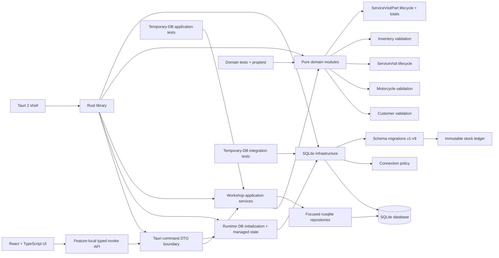

# Software Architecture

This is the living overview of how the application is connected. It reflects the current schema version 9 working tree and must be updated whenever responsibilities or data flow change.

## Current shape



## Frontend

- `src/main.tsx` mounts the React application.
- `src/features/dashboard/` owns the production workshop home screen, its feature-local typed `load_dashboard` transport, and the local-calendar-day boundary helper. It fetches a fresh bounded read model whenever the Dashboard mounts, renders real status/stock/issued-Invoice summaries plus at most five recent rows per widget, and routes persisted IDs into the existing Service Visit, Invoice, and Inventory details flows. `App.tsx` preserves Dashboard as the Back destination and passes useful READY_FOR_PICKUP/ACTIVE/ISSUED filters into the existing directories.
- `src/features/service/api/` owns the typed TypeScript contract and the Service Visit-related `invoke` wrappers for Customer and Motorcycle creation, registration reference data, Customer/Motorcycle lookup, the Service Visit directory, and Service Visit creation, workspace, Part, work-field, and lifecycle commands. It preserves known backend error categories and distinguishes non-contract transport failures.
- `src/features/customers/new-customer/` owns the isolated production dialog for Customer creation. It performs only required-field and surrounding-whitespace handling, delegates Jordan phone normalization and full validation to the Rust domain through the typed API, and returns the created Customer summary to its caller. It is intentionally not mounted in the application shell yet.
- `src/features/motorcycles/new-motorcycle/` owns the production dialog for registering a Motorcycle to an authoritative Customer context. It loads active make and color references through the typed API, requires the textual plate field, applies matching digit/dash shape feedback, preserves textual identity input for the Rust domain, and returns the existing joined Motorcycle projection to its caller.
- `src/features/motorcycles/` owns the production Motorcycles directory and ID-based details route. Its feature-local typed API submits bounded search to SQLite, loads one Motorcycle plus bounded newest-first Service history, and preserves the Motorcycle details origin while opening Customer Details or a real Service Visit workspace. The details route reuses the shared creation dialog with the current owner and usable Motorcycle preselected.
- `src/features/service/new-visit/` owns the shared production dialog for creating a Service Visit for an existing Customer and Motorcycle. The generic topbar flow searches Customers, while Customer Details supplies an optional authoritative preselected Customer. Both paths load that Customer's Motorcycles through the typed API, block Motorcycles whose lookup projection reports an active Visit, validate basic form shape, and return the created workspace.
- `src/features/service/directory/` owns the production Service sidebar page. It submits search text and status filters to the bounded Rust/SQLite directory boundary, defaults to active workshop work, renders joined Customer/Motorcycle identity and authoritative service totals, and loads the existing workspace command only after a row is selected.
- `src/features/inventory/` owns the production Inventory directory and ID-based details route. Its feature-local typed API is the only React knowledge of the six Inventory command names. The directory submits bounded name/SKU search to SQLite and renders ledger-derived stock, unit precision, exact integer-fils prices, and low-stock state. Details reload persisted metadata plus bounded newest-first immutable movement history after creation, metadata edits, or signed stock adjustments; quantity is never edited as Item metadata, and negative stock is presented with an explicit warning.
- `src/features/invoices/` owns the production Invoice directory, details view, and typed four-command transport. Search/status filtering is bounded in SQLite. DRAFT details are explicitly labeled live previews; ISSUED details render frozen customer, Motorcycle, line, and total snapshots. Navigation preserves both Service Visit-to-Invoice and Invoice-to-Service Visit origins.
- The active Customers flow is ID-based and SQLite-backed: the directory opens Customer Details by Customer ID; details reload after Motorcycle or Service Visit creation; history rows load a complete workspace by the persisted Service Visit ID; and `App.tsx` renders that returned `ServiceVisitWorkspace` without constructing preview domain objects. Back navigation retains the originating Customer Details route, while sidebar changes clear incompatible child state.
- `ServiceVisitPage` consumes the real workspace DTO directly and presents persisted owner, Motorcycle, work fields, ACTIVE/VOIDED Part history, and the labor-plus-active-parts service total. READY_FOR_PICKUP/CLOSED drafts expose the authoritative issue action; issued rows expose View Invoice.
- No persistence logic is embedded in React components.

## Tauri shell

- The application uses Tauri 2.
- `src-tauri/src/main.rs` starts `moto_workshop_lib::run()`.
- `src-tauri/src/lib.rs` configures the Tauri builder and opener plugin.
- Startup resolves Tauri's application-data directory, creates it when needed, opens `moto-workshop.sqlite3` through the established connection policy, and runs the v1-v9 migration runner before the application launches.
- The rusqlite connection is held in Tauri managed state behind a standard `Mutex`; each synchronous command locks it only for its application-service call.
- Startup path resolution, directory creation, database opening, and migration errors abort startup with a clear failure rather than continuing with an invalid database.
- The template `greet` command has been removed.
- Thirty-one workshop commands are registered. The existing Customer, Motorcycle, Service Visit, Inventory, and Invoice commands remain unchanged; Dashboard integration adds `load_dashboard`.

### Dashboard command boundary

`commands/dashboard.rs` exposes one thin synchronous `load_dashboard` command. Its explicit camelCase input `{ dayStartMs, dayEndMs }` denies unknown fields; the frontend supplies the inclusive local-midnight start and exclusive next-local-midnight end in the application's existing millisecond timestamp convention. The application service rejects negative, reversed, empty, or implausibly long ranges. The response contains only the summary and three bounded projections, and validation/database failures retain sanitized `validationError` or `databaseError` categories.

### Customer creation command boundary

`commands/customer.rs` exposes the synchronous `create_customer` command. Its explicit camelCase input denies unknown fields and contains only `{ name, phone, notes, createdAt }`; generated identity, archival state, normalization, and initial `updatedAt` are not caller-controlled. The command returns only generated ID, normalized name, and canonical phone. Domain failures map to `validationError`, canonical phone collisions map to `customerPhoneAlreadyExists`, and database details remain sanitized.

### Motorcycle registration command boundary

`commands/motorcycle_registration.rs` exposes the no-input synchronous `load_motorcycle_registration_reference_data` command and the synchronous `create_motorcycle` command. Reference data contains only active makes and colors as `{ id, name }`, grouped under the camelCase `makes` and `colors` fields.

The create command's explicit camelCase input denies unknown fields and contains only `{ customerId, makeId, model, year, plateNumber, vin, chassisNumber, colorId, notes, createdAt }`. `plateNumber` is a required string; VIN and chassis are optional. The command does not accept a current year, generated or normalized identity fields, `updatedAt`, archival state, or active-Visit state. It returns the existing joined `CustomerMotorcycleLookup` presentation. Missing or archived Customers map to `customerNotFound`; invalid catalog references, timestamps, and domain input map to `validationError`; identity collisions map to `motorcycleIdentityAlreadyExists`; and unexpected persistence details remain behind `databaseError`.

### Customer and Motorcycle lookup command boundary

`commands/service_visit_lookup.rs` exposes two thin synchronous commands with explicit camelCase inputs that deny unknown fields. `search_customers` accepts `{ query, limit? }`; `list_customer_motorcycles` accepts `{ customerId }`. Both arrive through the Tauri `input` wrapper, use the managed runtime database, and contain no SQL or lookup policy.

Customer summaries expose only ID, name, and phone. Motorcycle summaries expose current make, model, year, color, plate, VIN, chassis identity, and the ID/status of an OPEN or READY_FOR_PICKUP Service Visit when one exists. Missing Customers map to `customerNotFound`; unexpected persistence failures retain the sanitized `databaseError` contract.

### Service Visit command boundary

`commands/service_visit_workspace.rs` is a thin synchronous adapter. It contains no SQL or business validation. It maps explicit camelCase serde input/output DTOs to the existing application service and maps application failures to a stable `{ category, message }` command error.

Service Visit statuses serialize exactly as `OPEN`, `READY_FOR_PICKUP`, `CLOSED`, and `CANCELLED`. Part statuses serialize as `ACTIVE` and `VOIDED`; neither contract depends on Rust Debug formatting. Error categories serialize in camelCase: `customerNotFound`, `customerPhoneAlreadyExists`, `motorcycleIdentityAlreadyExists`, `motorcycleNotFound`, `activeServiceVisitExists`, `serviceVisitNotFound`, `inventoryItemNotFound`, `inventoryUnitNotFound`, `inventorySkuAlreadyExists`, `serviceVisitPartNotFound`, `lifecycleRejected`, `validationError`, and `databaseError`. Database messages deliberately omit raw SQL and SQLite details.

The create command accepts only Motorcycle ID, opening timestamp, optional odometer, complaint, optional notes, and creation timestamp. It cannot accept an owner snapshot or initial lifecycle/work/Invoice state. Motorcycle lookup and active-Visit checks are application responsibilities, while the domain produces the normalized OPEN aggregate and the schema-v5 trigger creates its single DRAFT Invoice.

The add-Part command accepts only Visit ID, Item ID, scaled quantity, charged unit price, and creation timestamp. Snapshot Item name, Unit name, quantity scale, and line total remain Rust/application responsibilities. Command inputs deny unknown fields, so caller-supplied database paths or forged snapshot fields are rejected during deserialization.

The four lifecycle commands accept only the Visit ID, their transition timestamp when applicable, an explicit `updatedAt`, and the cancellation reason only for cancellation. Each returns the refreshed complete workspace. Invalid domain transitions map to the existing `lifecycleRejected` category, while missing work, invalid chronology, and invalid cancellation reasons remain `validationError` failures.

### Service Visit directory command boundary

`commands/service_visit_directory.rs` exposes `list_service_visits` through an explicit camelCase input `{ query, statusFilter?, limit? }` that denies unknown fields. Filters serialize as `ACTIVE`, `ALL`, `OPEN`, `READY_FOR_PICKUP`, `CLOSED`, or `CANCELLED`; omitting the filter defaults to active work. The command returns only presentation fields already persisted or derived by the query and sanitizes database failures through the existing `databaseError` contract.

### Invoice command boundary

`commands/invoice.rs` exposes `list_invoices`, `load_invoice_details`, `load_service_visit_invoice`, and `issue_invoice`. Inputs are explicit camelCase DTOs that deny unknown fields; callers can provide only search/filter/limit, persisted IDs, and the issuance timestamp. Customer/Motorcycle snapshots, active lines, invoice number, and totals are always loaded/calculated in Rust. Stable errors add `invoiceNotFound`, `invoiceAlreadyIssued`, and `serviceVisitNotInvoiceable`; SQLite details remain behind `databaseError`.

### Motorcycle directory and details boundary

`commands/motorcycle_directory.rs` exposes `search_motorcycle_directory` and `load_motorcycle_details` through explicit camelCase inputs that deny unknown fields. Directory requests default to 50 rows and cap at 100. The focused repository excludes archived Motorcycles, searches persisted Motorcycle identity plus current owner identity in SQLite, joins the active Visit without N+1 queries, and reports the latest Visit timestamp. Details load by Motorcycle ID and use one bounded newest-first history query whose totals include labor and only ACTIVE Part lines. Missing or archived IDs map to `motorcycleNotFound`; persistence details remain behind `databaseError`.

### Inventory management command boundary

`commands/inventory.rs` exposes six thin synchronous commands with explicit camelCase DTOs. Search accepts `{ query, limit? }`; details accept only `{ inventoryItemId }`; active Units require no input; creation accepts Item metadata, Unit ID, optional nonnegative opening quantity, and a caller timestamp; update accepts safe mutable metadata but no Unit or current-quantity field; adjustment accepts only Item ID, a nonzero signed scaled delta, optional notes, and a timestamp. Unknown fields are rejected, so callers cannot inject current stock, movement types, historical rows, or database paths.

Stock movement types serialize as `OPENING_STOCK`, `PURCHASE`, `ADJUSTMENT_IN`, `ADJUSTMENT_OUT`, `SERVICE_USAGE`, and `SERVICE_USAGE_REVERSAL`. Missing or archived Items, inactive/missing Units, duplicate case-insensitive SKUs, invalid domain input, and unexpected database failures map to stable sanitized command categories.

## Rust library boundaries

`src-tauri/src/lib.rs` exposes five top-level areas and keeps repositories internal:

- `application`: production use-case orchestration;
- `commands`: serializable Tauri DTOs, handlers, and error mapping;
- `domain`: pure business validation and typed value objects.
- `db`: SQLite connection policy and ordered migrations.
- `repositories`: focused rusqlite persistence adapters used by the application layer.
- `runtime`: application-data path database initialization and managed connection state.

Domain objects do not depend on SQLite, Tauri, or the system clock. The application layer depends on domain behavior and concrete repository operations, while repositories contain SQL and row mapping but no workflow policy. No speculative generic repository abstraction exists.

## Domain modules

### Customer

`domain/customer.rs` owns creation-time Customer validation and normalization:

- private `NewCustomer` state with read-only accessors;
- Unicode-aware name and notes bounds;
- canonical Jordanian phone normalization;
- typed validation errors.

### Motorcycle

`domain/motorcycle.rs` owns Motorcycle input validation and identity value objects:

- required textual `PlateNumber`, accepting ASCII digits with optional dashes only between numeric groups;
- strict standardized `Vin`;
- separate `ChassisNumber` for non-VIN frame identifiers;
- model, year, notes, and identity validation;
- new registration requires plate, while VIN and chassis remain optional.

### Service Visit

`domain/service_visit.rs` models an active or historical workshop visit:

- `ServiceVisitStatus` contains only Open, ReadyForPickup, Closed, and Cancelled;
- creation produces an OPEN aggregate from named input;
- focused methods update active details and perform allowed lifecycle transitions;
- READY reopening clears `completed_at`;
- CLOSED/CANCELLED reject ordinary edits;
- complaint, optional workshop text, cancellation reason, odometer, and integer-fils labor are validated without persistence or clock dependencies.

The domain accepts an owner snapshot ID but cannot verify ownership itself. Migration 5 enforces that relationship against the current Motorcycle row at insertion.

### Inventory

`domain/inventory.rs` owns pure Inventory validation:

- `QuantityScale` permits only 1, 10, 100, or 1000 integer subunits per displayed unit;
- `InventoryUnit` normalizes reusable unit names;
- `InventoryItem` validates names, optional case-preserved SKU input, unit identity, integer-fils default prices, scaled minimum stock, and notes;
- `StockMovementType` includes the four manual types plus ServiceUsage and ServiceUsageReversal;
- linked usage types require a positive ServiceVisitPart ID and exact sign while manual types require no Part reference;
- `StockMovement` validates exact integer ranges and relationship shapes without querying current stock;
- all timestamps are supplied by callers, and no type depends on SQLite, Tauri, React, floating point, or the system clock.

Stock Movement instances expose no mutation behavior. Persistence supplies the permanent immutability boundary.

### Service Visit Part

`domain/service_visit_part.rs` owns immutable historical snapshots, ACTIVE-to-VOIDED lifecycle behavior, optional void-reason normalization, and the single checked integer line-total calculation. It accepts caller-supplied IDs, catalog snapshots, charged price, and timestamps but does not query persistence. SQLite verifies the snapshots against current catalog rows when inserting.

### Invoice

`domain/invoice.rs` accepts a persisted Invoice/Service Visit identity, completed lifecycle state, issuance timestamp, labor, and the already-authoritative ACTIVE ServiceVisitPart line totals. It permits only READY_FOR_PICKUP or CLOSED work, rejects issuance before completion, uses checked integer addition, and produces deterministic `INV-######` numbering plus labor/parts/grand totals without SQLite, Tauri, React, floating point, or the system clock.

## Persistence

### Customer creation repository and application service

`repositories/customer.rs` inserts only a domain-validated `NewCustomer`, stores caller-supplied `createdAt` into both initial timestamp columns, and returns the persisted ID/name/phone projection. It classifies SQLite's specific UNIQUE-constraint code as a phone collision without inspecting or exposing SQLite messages; every other persistence failure remains a database error. The database unique constraint stays authoritative under concurrent writers.

`application/customer.rs` rejects negative timestamps, constructs `NewCustomer` to obtain all name, phone, and notes normalization/validation, and performs insertion in one transaction. It never normalizes phone input independently and never uses the system clock. Blank normalized notes persist as NULL, and its result contains only the generated ID, normalized name, and canonical persisted phone.

### Motorcycle registration repository and application service

`repositories/motorcycle_registration.rs` contains the focused catalog, validation, trusted-year, and insert persistence used by Motorcycle onboarding. Catalog queries filter active makes and colors and order case-insensitively by presentation value with ID as a stable tiebreaker. Creation checks a current non-archived Customer and active make/color rows. The current local calendar year comes from SQLite's `strftime('%Y', 'now', 'localtime')` scalar rather than caller input. Insert persistence accepts only a domain-validated `NewMotorcycle`, stores its normalized string plate and optional VIN/chassis, initializes `updated_at` from `created_at`, and leaves `archived_at` NULL. SQLite UNIQUE result codes are classified as identity collisions without parsing or exposing database messages.

`application/motorcycle_registration.rs` bundles reference data and orchestrates creation in one transaction. It rejects a negative creation timestamp, performs authoritative Customer/reference checks, obtains the backend year, constructs `NewMotorcycle::new(NewMotorcycleInput, current_year)`, inserts the normalized aggregate, and reloads the created row through the existing joined Motorcycle presentation query before committing. Domain rules remain solely in `NewMotorcycle`; failed validation, lookup, insert, or reload leaves no partial Motorcycle row.

### Service Visit workspace repositories

`repositories/service_visit.rs` resolves a Motorcycle's current owner, checks for an existing active Visit, inserts domain-produced Service Visits, loads complete workspace headers and historical Part rows, and owns focused UPDATE statements for work fields, lifecycle fields, and Part mutations. It does not decide lifecycle or validation policy. `repositories/inventory.rs` loads selectable non-archived Inventory Items joined to active Unit metadata and derives each Item's scaled integer `currentQuantity` in the same query by summing its immutable Stock Movements. Zero-history Items return zero, and negative totals remain unchanged. Both repositories remain persistence-focused and return owned rows; they do not normalize business input or decide lifecycle policy.

### Inventory management repository and application service

`repositories/inventory.rs` also owns focused Inventory management SQL: one bounded escaped name/SKU directory query with joined Unit data and ledger aggregation; one persisted Item details query; one bounded newest-first movement query; active Unit listing/existence checks; Item insert/update; and immutable movement insert. Archived Items and inactive Units are excluded from the production directory. No per-row query is issued.

`application/inventory.rs` defaults directory reads to 50 and caps them at 100, while details include at most 100 newest movements. Creation validates the active Unit and domain Item inside one transaction, then optionally appends an `OPENING_STOCK` movement. Metadata update retains the persisted Unit and cannot mutate quantity. Signed stock adjustment selects `ADJUSTMENT_IN` or `ADJUSTMENT_OUT`, validates it through the existing StockMovement domain, appends it, and reloads authoritative details. Negative aggregate stock is intentionally preserved. Duplicate SKUs use SQLite's constraint result as authority and return a stable typed error without leaking database details.

### Service Visit directory repository and application service

`repositories/service_visit_directory.rs` runs one bounded joined query across Service Visits, owner snapshots, Motorcycles, and makes. Search uses bound parameters and escaped literal substring matching for Customer name/phone, plate, make, model, and combined make/model. The same statement derives `labor_charge_fils + ACTIVE Part line totals`; VOIDED Parts never affect the displayed total. Results are ordered OPEN, READY_FOR_PICKUP, then terminal history, with newest visits first inside each group.

`application/service_visit_directory.rs` trims search text, defaults to active work and 50 rows, caps caller limits at 100, maps the explicit filter into persistence scope, and returns presentation-focused entries. It does not load workspaces or perform lifecycle behavior.

### Service Visit creation lookup repository and application service

`repositories/service_visit_lookup.rs` owns the read-only SQL needed before Service Visit creation. Customer search uses bound parameters and literal substring matching across name and phone, excluding archived Customers and ordering by `updated_at DESC, id DESC`. SQLite LIKE metacharacters are escaped rather than treated as caller-controlled wildcards. Motorcycle lookup joins Motorcycle, make, color, its optional migrated string plate, and the possible OPEN/READY_FOR_PICKUP Visit in one deterministic query; archived Motorcycles and Visits in terminal states are not returned as selectable/active data.

`application/service_visit_lookup.rs` trims search text, defaults an omitted limit to 25, caps every requested limit at 100, distinguishes a missing Customer from an existing Customer with no Motorcycles, and maps persistence rows to presentation-focused application results. Motorcycle results order by case-insensitive make, case-insensitive model, then ID. The service is read-only and does not alter Service Visit creation behavior.

### Service Visit workspace application service

`application/service_visit_workspace.rs` is the first production use-case layer. It:

- creates a new Service Visit in an immediate SQLite transaction, deriving the owner snapshot from the Motorcycle and returning stable missing-Motorcycle or active-Visit errors before domain construction;
- delegates complaint, notes, odometer, timestamp, and initial-state validation to `ServiceVisit::open`, persists the resulting OPEN aggregate with `updatedAt = createdAt`, and relies on the existing schema trigger for exactly one DRAFT Invoice;
- loads a Service Visit with its owner snapshot, Motorcycle presentation data, and ACTIVE/VOIDED Part history;
- validates mutable work-field updates through the existing ServiceVisit domain lifecycle;
- restores the authoritative persisted aggregate and delegates ready, reopen, close, and cancel transitions to the existing ServiceVisit domain methods;
- persists every resulting lifecycle field plus caller-supplied `updatedAt` in the same transaction and returns the refreshed complete workspace;
- lists usable Inventory Items with current Unit name, scale, suggested selling price, and ledger-derived scaled integer current quantity;
- accepts only Item/Visit IDs, scaled quantity, charged price, and caller-supplied timestamps when adding a Part;
- loads Item and Unit snapshot metadata inside the transaction, constructs the ServiceVisitPart domain object, and persists its authoritative integer line total;
- voids ACTIVE parts through the existing domain normalization and chronology rules;
- wraps every read-validate-write mutation in one SQLite transaction, while schema-v7 triggers atomically append usage or reversal movements.

The service exposes typed not-found, lifecycle, domain-validation, and database errors. It has no Tauri or React dependency.

### Invoice repository and application service

`repositories/invoice.rs` owns focused joined SQL for the bounded Invoice directory, draft/issued details, issuance source loading, snapshot-line inserts, and the final Invoice update. Directory totals use one SQL statement and no per-row reads. DRAFT details deliberately project current persisted labor and ACTIVE Parts; ISSUED/CANCELLED details read only frozen Invoice/line fields.

`application/invoice.rs` trims and caps directory requests at 100. Issuance opens an immediate transaction, rejects a missing or non-DRAFT invoice, loads the Service Visit/Customer/Motorcycle and ACTIVE lines, delegates lifecycle and checked total rules to `InvoiceIssue`, inserts immutable line snapshots, updates the Invoice snapshot, reloads it, then commits. Failed validation, duplicate issuance, line insert, snapshot update, or reload rolls the whole operation back. Payments are intentionally absent because there is no existing settlement model.

### Dashboard repository and application service

`repositories/dashboard.rs` owns four read-only operations: one aggregate summary query and one bounded query each for recent Service Visits, recent ISSUED Invoice snapshots, and Inventory alerts. Each list is limited to five in Rust, uses joins or aggregate CTEs rather than per-row reads, excludes archived Items/inactive Units from stock metrics, derives current stock from immutable movements, orders negative stock before other below-minimum alerts, and reads issued value directly from immutable Invoice `total_fils` snapshots.

`application/dashboard.rs` validates the caller's local-day millisecond range and orchestrates those four persistence calls without adding domain mutations. Active jobs mean `OPEN` plus `READY_FOR_PICKUP`; the ready count is the READY subset. Customer and Motorcycle summary counts exclude archived records. “Issued today” uses the half-open range `issued_at >= dayStartMs AND issued_at < dayEndMs`, so a next-midnight Invoice belongs only to the following day.

### Connection policy

`db/connection.rs` opens SQLite with:

- foreign keys enabled;
- WAL journal mode;
- FULL synchronous mode;
- five-second busy timeout.

### Migration runner

`db/migrations.rs` reads `PRAGMA user_version`, rejects unsupported future schemas, and runs each missing migration in order. Each migration owns a literal version stamp and transaction.

Current schema flow:

```text
v0 -> v1 Customers
   -> v2 Motorcycle catalogs and Motorcycles
   -> v3 Customer persistence hardening
   -> v4 chassis-aware Motorcycle identity
   -> v5 ServiceVisit lifecycle integrity and skeletal Invoices
   -> v6 Inventory Units, Inventory Items, and immutable Stock Movements
   -> v7 ServiceVisitPart snapshots and automatic usage/reversal movements
   -> v8 textual Motorcycle plate identity
   -> v9 immutable issued-Invoice and Invoice-line snapshots
```

The authoritative table-level detail is in `DATABASE_SCHEMA.md`.

### Inventory ledger

There is no authoritative current-stock field. Current stock is derived for one Inventory Item as `COALESCE(SUM(stock_movements.quantity_delta), 0)`. Negative totals are intentionally allowed. Corrections append compensating movements; database triggers prevent changing or deleting ledger history.

Every quantity is an integer interpreted through the Item's reusable Unit scale. Prices are integer fils per displayed Unit. The database freezes a referenced Unit's scale and freezes an Item's Unit once its first movement exists, preventing historical reinterpretation.

Migration 7 rebuilds `stock_movements` transactionally, preserves every v6 row and ID with a NULL Part reference, restores immutability and Item Unit-freeze behavior, and adds automatic linked usage/reversal entries. A part may be added or voided in OPEN or READY_FOR_PICKUP; CLOSED/CANCELLED preserve history but block mutation. Void-and-replace is the correction model.

## Test strategy

- `src-tauri/tests/domain/` tests pure domain behavior and uses `proptest` for input-safety properties.
- `src-tauri/tests/database/` uses isolated temporary SQLite databases for connection, migration, catalog, Customer, Motorcycle, ServiceVisit, Invoice, Inventory, and stock-ledger integration behavior.
- `src-tauri/tests/application/` uses isolated temporary SQLite databases to verify Customer creation and canonical duplicate handling, active Motorcycle registration catalogs, transactional Motorcycle creation through authoritative domain rules and trusted backend year, Customer/Motorcycle lookup, authoritative-owner Service Visit creation, draft-Invoice effects, Inventory creation/edit/search/limits/duplicate handling/signed ledger adjustment, bounded Dashboard aggregation/list ordering/day boundaries, repository queries, and complete workspace use cases across the application/domain/schema boundaries.
- Rust command integration tests exercise handlers against real temporary schema-v9 databases, including onboarding, bounded directory, Dashboard, and lookup results, Inventory and Invoice command DTOs, runtime migration, camelCase DTO mapping, lifecycle/issuance orchestration, stable status/error serialization, safe inputs, and sanitized duplicate/database failures.
- Migration tests exercise the public migration runner and observable stopping points instead of private migration functions.
- Frontend compilation is verified with `npm run build`; Vitest exercises feature-local Dashboard, Service Visit, Inventory, and Invoice APIs at the Tauri transport boundary. React Testing Library with jsdom verifies Dashboard loading/error/empty/action behavior and origin-aware directory/details/create/edit/adjust/issue navigation while mocking only each feature's typed API boundary.

## Current end-to-end shape

The Dashboard, Customers, Motorcycles, Service, Inventory, and Invoices sidebar flows are production SQLite-backed paths. Dashboard cards route to relevant filtered production lists, while its bounded recent rows open authoritative details and return to a freshly loaded Dashboard. Invoice search/filtering is bounded in SQLite; details open by persisted ID. A completed Service Visit issues its one existing DRAFT invoice, snapshots only ACTIVE lines, and routes to authoritative details. Back navigation returns to the originating Dashboard, Service Visit, or directory; opening the linked Service Visit returns to the Invoice without losing its earlier origin. Existing Inventory ledger and Service Visit flows remain the sole sources for quantity and work totals.

## Deferred financial integration

Schema v9 issues and numbers exact snapshot Invoices. Invoice cancellation actions, payments/settlement, discounts, taxes, and print/export remain deferred because the current product has no compatible payment or fiscal model.

## Documentation synchronization

When persistence changes, update `DATABASE_SCHEMA.md` and the persistence/migration sections here. When modules, commands, use cases, or UI-to-Rust flow change, update this document. A feature is not complete while these descriptions disagree with the working tree.
