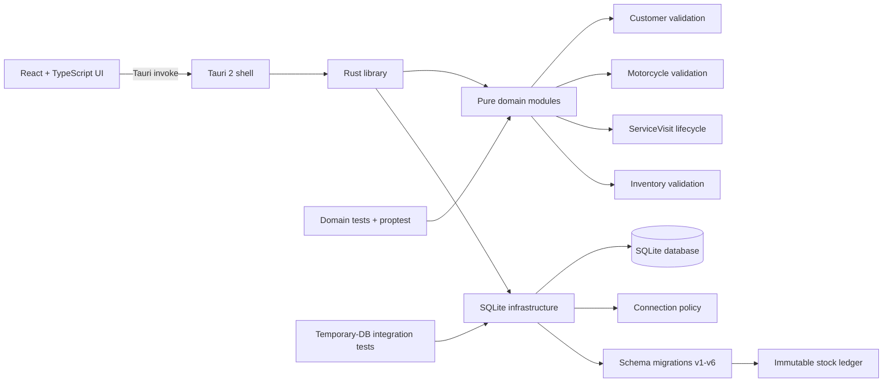

# Software Architecture

This is the living overview of how the application is connected. It reflects the current schema version 6 working tree and must be updated whenever responsibilities or data flow change.

## Current shape



## Frontend

- `src/main.tsx` mounts the React application.
- `src/App.tsx` is still the default Tauri/Vite demonstration UI.
- No Customer or Motorcycle production UI exists yet.
- The frontend contains no persistence logic.

## Tauri shell

- The application uses Tauri 2.
- `src-tauri/src/main.rs` starts `moto_workshop_lib::run()`.
- `src-tauri/src/lib.rs` configures the Tauri builder and opener plugin.
- The only registered command is the template `greet` command. No workshop CRUD commands exist yet.

## Rust library boundaries

`src-tauri/src/lib.rs` exposes two top-level areas:

- `domain`: pure business validation and typed value objects.
- `db`: SQLite connection policy and ordered migrations.

There is not yet an application/use-case layer or repository abstraction. Domain objects do not depend on SQLite, Tauri, or the system clock.

## Domain modules

### Customer

`domain/customer.rs` owns creation-time Customer validation and normalization:

- private `NewCustomer` state with read-only accessors;
- Unicode-aware name and notes bounds;
- canonical Jordanian phone normalization;
- typed validation errors.

### Motorcycle

`domain/motorcycle.rs` owns Motorcycle input validation and identity value objects:

- `PlateNumber` and complete `JordanPlate`;
- strict standardized `Vin`;
- separate `ChassisNumber` for non-VIN frame identifiers;
- model, year, notes, and identity validation;
- identity requires plate, VIN, or chassis.

### Service Visit

`domain/service_visit.rs` models an active or historical workshop visit:

- `ServiceVisitStatus` contains only Open, ReadyForPickup, Closed, and Cancelled;
- creation produces an OPEN aggregate from named input;
- focused methods update active details and perform allowed lifecycle transitions;
- READY reopening clears `completed_at`;
- CLOSED/CANCELLED reject ordinary edits;
- complaint, optional workshop text, cancellation reason, odometer, and integer-fils labor are validated without persistence or clock dependencies.

The domain accepts an owner snapshot ID but cannot verify ownership itself. Migration 5 enforces that relationship against the current Motorcycle row at insertion.

### Inventory

`domain/inventory.rs` owns pure Inventory validation:

- `QuantityScale` permits only 1, 10, 100, or 1000 integer subunits per displayed unit;
- `InventoryUnit` normalizes reusable unit names;
- `InventoryItem` validates names, optional case-preserved SKU input, unit identity, integer-fils default prices, scaled minimum stock, and notes;
- `StockMovementType` contains only OpeningStock, Purchase, AdjustmentIn, and AdjustmentOut;
- `StockMovement` validates exact integer ranges and movement signs without querying current stock;
- all timestamps are supplied by callers, and no type depends on SQLite, Tauri, React, floating point, or the system clock.

Stock Movement instances expose no mutation behavior. Persistence supplies the permanent immutability boundary.

## Persistence

### Connection policy

`db/connection.rs` opens SQLite with:

- foreign keys enabled;
- WAL journal mode;
- FULL synchronous mode;
- five-second busy timeout.

### Migration runner

`db/migrations.rs` reads `PRAGMA user_version`, rejects unsupported future schemas, and runs each missing migration in order. Each migration owns a literal version stamp and transaction.

Current schema flow:

```text
v0 -> v1 Customers
   -> v2 Motorcycle catalogs and Motorcycles
   -> v3 Customer persistence hardening
   -> v4 chassis-aware Motorcycle identity
   -> v5 ServiceVisit lifecycle integrity and skeletal Invoices
   -> v6 Inventory Units, Inventory Items, and immutable Stock Movements
```

The authoritative table-level detail is in `DATABASE_SCHEMA.md`.

### Inventory ledger

Migration 6 stores no authoritative current-stock field. Current stock is derived for one Inventory Item as `COALESCE(SUM(stock_movements.quantity_delta), 0)`. Negative totals are intentionally allowed. Corrections append compensating movements; database triggers prevent changing or deleting ledger history.

Every quantity is an integer interpreted through the Item's reusable Unit scale. Prices are integer fils per displayed Unit. The database freezes a referenced Unit's scale and freezes an Item's Unit once its first movement exists, preventing historical reinterpretation.

## Test strategy

- `src-tauri/tests/domain/` tests pure domain behavior and uses `proptest` for input-safety properties.
- `src-tauri/tests/database/` uses isolated temporary SQLite databases for connection, migration, catalog, Customer, Motorcycle, ServiceVisit, Invoice, Inventory, and stock-ledger integration behavior.
- Migration tests exercise the public migration runner and observable stopping points instead of private migration functions.
- Frontend compilation is verified with `npm run build`; there are no feature-level frontend tests yet.

## Current end-to-end limitation

The validated domain and SQLite foundation are not connected to the React UI. There are no repositories, application services, or Tauri commands for workshop data. ServiceVisit creation therefore has no production orchestration layer yet; the database trigger nevertheless guarantees a draft Invoice for every raw persisted visit. Inventory operations likewise have no production orchestration or UI yet. The only current runtime UI interaction is the template greeting command.

## Deferred ServiceVisit parts integration

Schema v6 deliberately does not connect Inventory to Service Visits. The next schema slice must introduce ServiceVisitPart with scaled quantity, a selling-price snapshot, integer per-line calculation rounded to the nearest fil with exact halves upward, and atomic negative `SERVICE_USAGE` ledger entries. Corrections will use `SERVICE_USAGE_REVERSAL`; usage rows will remain historical through ACTIVE/VOIDED semantics with optional `void_reason`, and CLOSED/CANCELLED visits will reject parts mutation. These are documented requirements, not implemented behavior.

## Documentation synchronization

When persistence changes, update `DATABASE_SCHEMA.md` and the persistence/migration sections here. When modules, commands, use cases, or UI-to-Rust flow change, update this document. A feature is not complete while these descriptions disagree with the working tree.
