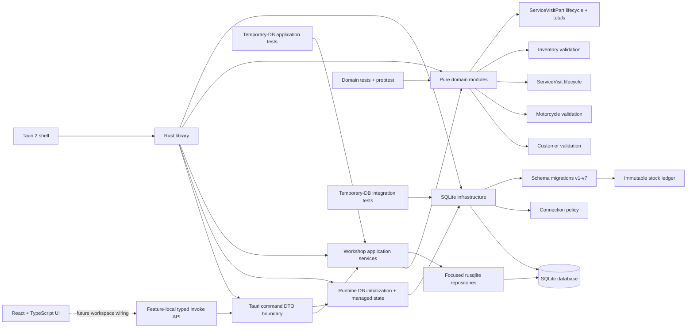

# Software Architecture

This is the living overview of how the application is connected. It reflects the current schema version 7 working tree and must be updated whenever responsibilities or data flow change.

## Current shape



## Frontend

- `src/main.tsx` mounts the React application.
- `src/features/service/api/` owns the typed TypeScript contract and the fifteen `invoke` wrappers for Customer and Motorcycle creation, Motorcycle registration reference data, Customer/Motorcycle lookup, and Service Visit creation, workspace, Part, work-field, and lifecycle commands. It preserves known backend error categories and distinguishes non-contract transport failures.
- `src/features/customers/new-customer/` owns the isolated production dialog for Customer creation. It performs only required-field and surrounding-whitespace handling, delegates Jordan phone normalization and full validation to the Rust domain through the typed API, and returns the created Customer summary to its caller. It is intentionally not mounted in the application shell yet.
- `src/features/service/new-visit/` owns the self-contained production dialog for creating a Service Visit for an existing Customer and Motorcycle. The dialog uses only the typed feature API, loads recent/search results, blocks Motorcycles whose lookup projection reports an active Visit, validates basic form shape, and passes the returned workspace to its caller. It is intentionally not mounted in the application shell yet.
- Current workshop screens still use frontend preview data and do not invoke the new backend commands yet.
- No persistence logic is embedded in React components.

## Tauri shell

- The application uses Tauri 2.
- `src-tauri/src/main.rs` starts `moto_workshop_lib::run()`.
- `src-tauri/src/lib.rs` configures the Tauri builder and opener plugin.
- Startup resolves Tauri's application-data directory, creates it when needed, opens `moto-workshop.sqlite3` through the established connection policy, and runs the v1-v7 migration runner before the application launches.
- The rusqlite connection is held in Tauri managed state behind a standard `Mutex`; each synchronous command locks it only for its application-service call.
- Startup path resolution, directory creation, database opening, and migration errors abort startup with a clear failure rather than continuing with an invalid database.
- The template `greet` command has been removed.
- Fifteen workshop commands are registered. Customer onboarding provides `create_customer`; Motorcycle onboarding provides `load_motorcycle_registration_reference_data` and `create_motorcycle`; the read-only Service Visit creation lookup boundary provides `search_customers` and `list_customer_motorcycles`; the existing workspace boundary provides `create_service_visit`, `load_service_visit_workspace`, `list_service_visit_inventory_items`, `update_service_visit_work`, `add_service_visit_part`, `void_service_visit_part`, `mark_service_visit_ready_for_pickup`, `reopen_service_visit`, `close_service_visit`, and `cancel_service_visit`.

### Customer creation command boundary

`commands/customer.rs` exposes the synchronous `create_customer` command. Its explicit camelCase input denies unknown fields and contains only `{ name, phone, notes, createdAt }`; generated identity, archival state, normalization, and initial `updatedAt` are not caller-controlled. The command returns only generated ID, normalized name, and canonical phone. Domain failures map to `validationError`, canonical phone collisions map to `customerPhoneAlreadyExists`, and database details remain sanitized.

### Motorcycle registration command boundary

`commands/motorcycle_registration.rs` exposes the no-input synchronous `load_motorcycle_registration_reference_data` command and the synchronous `create_motorcycle` command. Reference data contains active makes and colors as `{ id, name }` plus active Jordan plate codes as `{ id, code }`, grouped under the camelCase `makes`, `colors`, and `plateCodes` fields.

The create command's explicit camelCase input denies unknown fields and contains only `{ customerId, makeId, model, year, plateCodeId, plateNumber, vin, chassisNumber, colorId, notes, createdAt }`. It does not accept a current year, generated or normalized identity fields, `updatedAt`, archival state, or active-Visit state. It returns the existing joined `CustomerMotorcycleLookup` presentation. Missing or archived Customers map to `customerNotFound`; invalid catalog references, timestamps, and domain input map to `validationError`; identity collisions map to `motorcycleIdentityAlreadyExists`; and unexpected persistence details remain behind `databaseError`.

### Customer and Motorcycle lookup command boundary

`commands/service_visit_lookup.rs` exposes two thin synchronous commands with explicit camelCase inputs that deny unknown fields. `search_customers` accepts `{ query, limit? }`; `list_customer_motorcycles` accepts `{ customerId }`. Both arrive through the Tauri `input` wrapper, use the managed runtime database, and contain no SQL or lookup policy.

Customer summaries expose only ID, name, and phone. Motorcycle summaries expose current make, model, year, color, plate, VIN, chassis identity, and the ID/status of an OPEN or READY_FOR_PICKUP Service Visit when one exists. Missing Customers map to `customerNotFound`; unexpected persistence failures retain the sanitized `databaseError` contract.

### Service Visit command boundary

`commands/service_visit_workspace.rs` is a thin synchronous adapter. It contains no SQL or business validation. It maps explicit camelCase serde input/output DTOs to the existing application service and maps application failures to a stable `{ category, message }` command error.

Service Visit statuses serialize exactly as `OPEN`, `READY_FOR_PICKUP`, `CLOSED`, and `CANCELLED`. Part statuses serialize as `ACTIVE` and `VOIDED`; neither contract depends on Rust Debug formatting. Error categories serialize in camelCase: `customerNotFound`, `customerPhoneAlreadyExists`, `motorcycleIdentityAlreadyExists`, `motorcycleNotFound`, `activeServiceVisitExists`, `serviceVisitNotFound`, `inventoryItemNotFound`, `serviceVisitPartNotFound`, `lifecycleRejected`, `validationError`, and `databaseError`. Database messages deliberately omit raw SQL and SQLite details.

The create command accepts only Motorcycle ID, opening timestamp, optional odometer, complaint, optional notes, and creation timestamp. It cannot accept an owner snapshot or initial lifecycle/work/Invoice state. Motorcycle lookup and active-Visit checks are application responsibilities, while the domain produces the normalized OPEN aggregate and the schema-v5 trigger creates its single DRAFT Invoice.

The add-Part command accepts only Visit ID, Item ID, scaled quantity, charged unit price, and creation timestamp. Snapshot Item name, Unit name, quantity scale, and line total remain Rust/application responsibilities. Command inputs deny unknown fields, so caller-supplied database paths or forged snapshot fields are rejected during deserialization.

The four lifecycle commands accept only the Visit ID, their transition timestamp when applicable, an explicit `updatedAt`, and the cancellation reason only for cancellation. Each returns the refreshed complete workspace. Invalid domain transitions map to the existing `lifecycleRejected` category, while missing work, invalid chronology, and invalid cancellation reasons remain `validationError` failures.

## Rust library boundaries

`src-tauri/src/lib.rs` exposes five top-level areas and keeps repositories internal:

- `application`: production use-case orchestration;
- `commands`: serializable Tauri DTOs, handlers, and error mapping;
- `domain`: pure business validation and typed value objects.
- `db`: SQLite connection policy and ordered migrations.
- `repositories`: focused rusqlite persistence adapters used by the application layer.
- `runtime`: application-data path database initialization and managed connection state.

Domain objects do not depend on SQLite, Tauri, or the system clock. The application layer depends on domain behavior and concrete repository operations, while repositories contain SQL and row mapping but no workflow policy. No speculative generic repository abstraction exists.

## Domain modules

### Customer

`domain/customer.rs` owns creation-time Customer validation and normalization:

- private `NewCustomer` state with read-only accessors;
- Unicode-aware name and notes bounds;
- canonical Jordanian phone normalization;
- typed validation errors.

### Motorcycle

`domain/motorcycle.rs` owns Motorcycle input validation and identity value objects:

- `PlateNumber` and complete `JordanPlate`;
- strict standardized `Vin`;
- separate `ChassisNumber` for non-VIN frame identifiers;
- model, year, notes, and identity validation;
- identity requires plate, VIN, or chassis.

### Service Visit

`domain/service_visit.rs` models an active or historical workshop visit:

- `ServiceVisitStatus` contains only Open, ReadyForPickup, Closed, and Cancelled;
- creation produces an OPEN aggregate from named input;
- focused methods update active details and perform allowed lifecycle transitions;
- READY reopening clears `completed_at`;
- CLOSED/CANCELLED reject ordinary edits;
- complaint, optional workshop text, cancellation reason, odometer, and integer-fils labor are validated without persistence or clock dependencies.

The domain accepts an owner snapshot ID but cannot verify ownership itself. Migration 5 enforces that relationship against the current Motorcycle row at insertion.

### Inventory

`domain/inventory.rs` owns pure Inventory validation:

- `QuantityScale` permits only 1, 10, 100, or 1000 integer subunits per displayed unit;
- `InventoryUnit` normalizes reusable unit names;
- `InventoryItem` validates names, optional case-preserved SKU input, unit identity, integer-fils default prices, scaled minimum stock, and notes;
- `StockMovementType` includes the four manual types plus ServiceUsage and ServiceUsageReversal;
- linked usage types require a positive ServiceVisitPart ID and exact sign while manual types require no Part reference;
- `StockMovement` validates exact integer ranges and relationship shapes without querying current stock;
- all timestamps are supplied by callers, and no type depends on SQLite, Tauri, React, floating point, or the system clock.

Stock Movement instances expose no mutation behavior. Persistence supplies the permanent immutability boundary.

### Service Visit Part

`domain/service_visit_part.rs` owns immutable historical snapshots, ACTIVE-to-VOIDED lifecycle behavior, optional void-reason normalization, and the single checked integer line-total calculation. It accepts caller-supplied IDs, catalog snapshots, charged price, and timestamps but does not query persistence. SQLite verifies the snapshots against current catalog rows when inserting.

## Persistence

### Customer creation repository and application service

`repositories/customer.rs` inserts only a domain-validated `NewCustomer`, stores caller-supplied `createdAt` into both initial timestamp columns, and returns the persisted ID/name/phone projection. It classifies SQLite's specific UNIQUE-constraint code as a phone collision without inspecting or exposing SQLite messages; every other persistence failure remains a database error. The database unique constraint stays authoritative under concurrent writers.

`application/customer.rs` rejects negative timestamps, constructs `NewCustomer` to obtain all name, phone, and notes normalization/validation, and performs insertion in one transaction. It never normalizes phone input independently and never uses the system clock. Blank normalized notes persist as NULL, and its result contains only the generated ID, normalized name, and canonical persisted phone.

### Motorcycle registration repository and application service

`repositories/motorcycle_registration.rs` contains the focused catalog, validation, trusted-year, and insert persistence used by Motorcycle onboarding. Catalog queries filter `active = 1` and order case-insensitively by presentation value with ID as a stable tiebreaker. Creation checks a current non-archived Customer and active make, color, and optional plate-code rows. The current local calendar year comes from SQLite's `strftime('%Y', 'now', 'localtime')` scalar rather than caller input. Insert persistence accepts only a domain-validated `NewMotorcycle`, stores its normalized values, initializes `updated_at` from `created_at`, and leaves `archived_at` NULL. SQLite UNIQUE result codes are classified as identity collisions without parsing or exposing database messages.

`application/motorcycle_registration.rs` bundles reference data and orchestrates creation in one transaction. It rejects a negative creation timestamp, performs authoritative Customer/reference checks, obtains the backend year, constructs `NewMotorcycle::new(NewMotorcycleInput, current_year)`, inserts the normalized aggregate, and reloads the created row through the existing joined Motorcycle presentation query before committing. Domain rules remain solely in `NewMotorcycle`; failed validation, lookup, insert, or reload leaves no partial Motorcycle row.

### Service Visit workspace repositories

`repositories/service_visit.rs` resolves a Motorcycle's current owner, checks for an existing active Visit, inserts domain-produced Service Visits, loads complete workspace headers and historical Part rows, and owns focused UPDATE statements for work fields, lifecycle fields, and Part mutations. It does not decide lifecycle or validation policy. `repositories/inventory.rs` loads selectable non-archived Inventory Items joined to active Unit metadata and derives each Item's scaled integer `currentQuantity` in the same query by summing its immutable Stock Movements. Zero-history Items return zero, and negative totals remain unchanged. Both repositories remain persistence-focused and return owned rows; they do not normalize business input or decide lifecycle policy.

### Service Visit creation lookup repository and application service

`repositories/service_visit_lookup.rs` owns the read-only SQL needed before Service Visit creation. Customer search uses bound parameters and literal substring matching across name and phone, excluding archived Customers and ordering by `updated_at DESC, id DESC`. SQLite LIKE metacharacters are escaped rather than treated as caller-controlled wildcards. Motorcycle lookup joins Motorcycle, make, color, optional plate code, and the possible OPEN/READY_FOR_PICKUP Visit in one deterministic query; archived Motorcycles and Visits in terminal states are not returned as selectable/active data.

`application/service_visit_lookup.rs` trims search text, defaults an omitted limit to 25, caps every requested limit at 100, distinguishes a missing Customer from an existing Customer with no Motorcycles, and maps persistence rows to presentation-focused application results. Motorcycle results order by case-insensitive make, case-insensitive model, then ID. The service is read-only and does not alter Service Visit creation behavior.

### Service Visit workspace application service

`application/service_visit_workspace.rs` is the first production use-case layer. It:

- creates a new Service Visit in an immediate SQLite transaction, deriving the owner snapshot from the Motorcycle and returning stable missing-Motorcycle or active-Visit errors before domain construction;
- delegates complaint, notes, odometer, timestamp, and initial-state validation to `ServiceVisit::open`, persists the resulting OPEN aggregate with `updatedAt = createdAt`, and relies on the existing schema trigger for exactly one DRAFT Invoice;
- loads a Service Visit with its owner snapshot, Motorcycle presentation data, and ACTIVE/VOIDED Part history;
- validates mutable work-field updates through the existing ServiceVisit domain lifecycle;
- restores the authoritative persisted aggregate and delegates ready, reopen, close, and cancel transitions to the existing ServiceVisit domain methods;
- persists every resulting lifecycle field plus caller-supplied `updatedAt` in the same transaction and returns the refreshed complete workspace;
- lists usable Inventory Items with current Unit name, scale, suggested selling price, and ledger-derived scaled integer current quantity;
- accepts only Item/Visit IDs, scaled quantity, charged price, and caller-supplied timestamps when adding a Part;
- loads Item and Unit snapshot metadata inside the transaction, constructs the ServiceVisitPart domain object, and persists its authoritative integer line total;
- voids ACTIVE parts through the existing domain normalization and chronology rules;
- wraps every read-validate-write mutation in one SQLite transaction, while schema-v7 triggers atomically append usage or reversal movements.

The service exposes typed not-found, lifecycle, domain-validation, and database errors. It has no Tauri or React dependency.

### Connection policy

`db/connection.rs` opens SQLite with:

- foreign keys enabled;
- WAL journal mode;
- FULL synchronous mode;
- five-second busy timeout.

### Migration runner

`db/migrations.rs` reads `PRAGMA user_version`, rejects unsupported future schemas, and runs each missing migration in order. Each migration owns a literal version stamp and transaction.

Current schema flow:

```text
v0 -> v1 Customers
   -> v2 Motorcycle catalogs and Motorcycles
   -> v3 Customer persistence hardening
   -> v4 chassis-aware Motorcycle identity
   -> v5 ServiceVisit lifecycle integrity and skeletal Invoices
   -> v6 Inventory Units, Inventory Items, and immutable Stock Movements
   -> v7 ServiceVisitPart snapshots and automatic usage/reversal movements
```

The authoritative table-level detail is in `DATABASE_SCHEMA.md`.

### Inventory ledger

There is no authoritative current-stock field. Current stock is derived for one Inventory Item as `COALESCE(SUM(stock_movements.quantity_delta), 0)`. Negative totals are intentionally allowed. Corrections append compensating movements; database triggers prevent changing or deleting ledger history.

Every quantity is an integer interpreted through the Item's reusable Unit scale. Prices are integer fils per displayed Unit. The database freezes a referenced Unit's scale and freezes an Item's Unit once its first movement exists, preventing historical reinterpretation.

Migration 7 rebuilds `stock_movements` transactionally, preserves every v6 row and ID with a NULL Part reference, restores immutability and Item Unit-freeze behavior, and adds automatic linked usage/reversal entries. A part may be added or voided in OPEN or READY_FOR_PICKUP; CLOSED/CANCELLED preserve history but block mutation. Void-and-replace is the correction model.

## Test strategy

- `src-tauri/tests/domain/` tests pure domain behavior and uses `proptest` for input-safety properties.
- `src-tauri/tests/database/` uses isolated temporary SQLite databases for connection, migration, catalog, Customer, Motorcycle, ServiceVisit, Invoice, Inventory, and stock-ledger integration behavior.
- `src-tauri/tests/application/` uses isolated temporary SQLite databases to verify Customer creation and canonical duplicate handling, active Motorcycle registration catalogs, transactional Motorcycle creation through authoritative domain rules and trusted backend year, Customer/Motorcycle lookup, authoritative-owner Service Visit creation, draft-Invoice effects, repository queries, and complete workspace use cases across the application/domain/schema boundaries.
- Rust command integration tests exercise handlers against real temporary schema-v7 databases, including onboarding and lookup results, runtime migration, camelCase DTO mapping, lifecycle orchestration, stable status/error serialization, safe inputs, and sanitized duplicate/database failures.
- Migration tests exercise the public migration runner and observable stopping points instead of private migration functions.
- Frontend compilation is verified with `npm run build`; Vitest exercises the feature-local Service Visit API at the Tauri transport boundary. React Testing Library with jsdom verifies the isolated Customer and new-Visit dialogs through visible behavior while mocking only the typed API functions each dialog calls.

## Current end-to-end limitation

The Service Visit feature now has production Customer creation, Motorcycle registration and reference data, Customer/Motorcycle lookup, and application orchestration for Visit creation, work, Parts, and existing lifecycle transitions. Runtime database initialization, registered Tauri commands, feature-local typed TypeScript invoke wrappers, an isolated new-Customer dialog, and an isolated existing-Customer/Motorcycle new-Visit dialog are present. Replacement of frontend preview data and application-shell/topbar wiring remain deferred, so current screens do not mount these dialogs or call these boundaries yet.

## Deferred Invoice integration

ServiceVisitPart line totals are historical snapshots, but schema v7 does not calculate or persist Invoice totals and does not finalize, issue, number, cancel, print, or accept payments for Invoices. Those workflows require a later explicit slice.

## Documentation synchronization

When persistence changes, update `DATABASE_SCHEMA.md` and the persistence/migration sections here. When modules, commands, use cases, or UI-to-Rust flow change, update this document. A feature is not complete while these descriptions disagree with the working tree.
